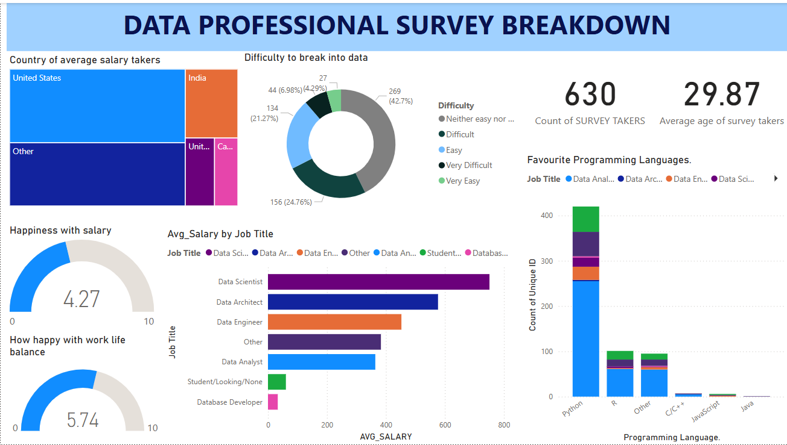

# 📊 Power BI Dashboard: Data Professional Survey Breakdown

This Power BI dashboard analyzes insights from a professional survey of data practitioners.

## 📁 File Included
- `Data professional survey breakdown.pbix`: The complete Power BI dashboard file.

  ## 🖼️ Dashboard Preview

## 🔍 Dashboard Features
- Distribution of job roles
- Average salary by role and region
- Work-life balance and job satisfaction
- Preferred tools and platforms

## 🛠️ Tools Used
- Power BI Desktop
- Data Cleaning and Visualization techniques

## 📌 How to Use
1. Download the `.pbix` file from this repo
2. Open with Power BI Desktop
3. Explore and interact with the visuals

---
*Created by Bidisha Pal*
